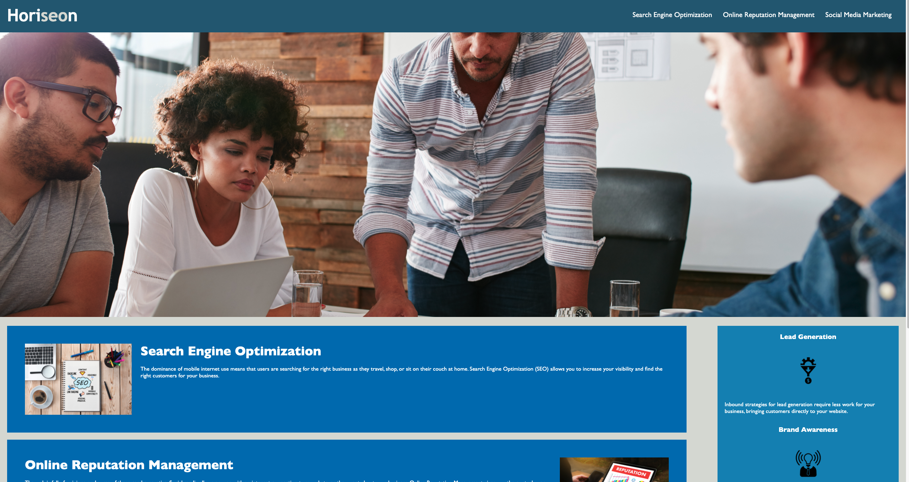

# Horiseon

Making Horiseon webpage accessible

## Description

On this webpage I had to change the HTML to semantic HTML. I did this by using a header tag, alt tags, and footer tags. I also changed some div tags to section tags. Also in the css I added comments.

## Link

[Link to Webpage](https://rubbokate.github.io/week1homework/)

## Screenshots

